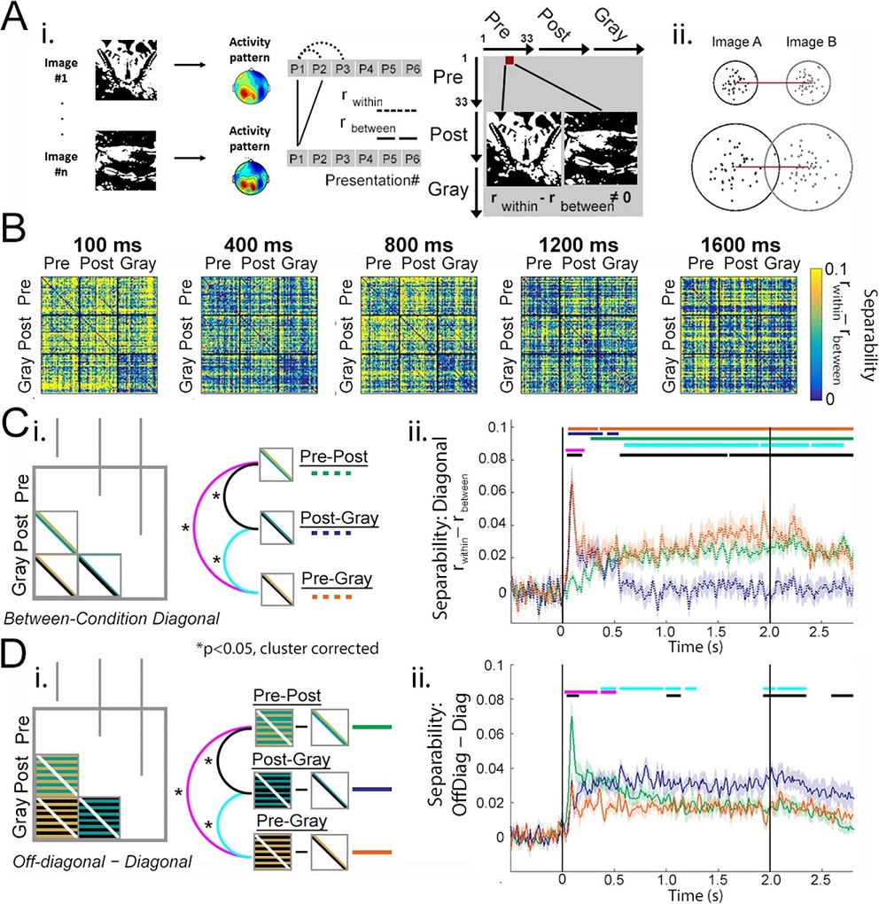

# README - Mooney MEG Project
By: 		MW Flounders and R Hardstone

Date:       20190228

Use: 		Flounders et al., 2019, Neural Dynamics of visual ambiguity resolution by perceptual prior
            [https://elifesciences.org/articles/41861]

## Folder structure:
______________________________________________________________________________________________________
### /Data: raw and processed mat files for analysis and plotting 
- Framework for a given figure: Raw data (e.g. RDM) --analysis--> permutations and statistics --plotting--> Figure
#### /Data/Raw: includes RDM data for MEG, fMRI, and Models used to generate Figure 4, 5 and 6
- FMRI_RDM.mat contains two variables
    - FMRI_RDM: image x image x ROI (matrix, 99 x 99 x 20)
    - ROI_labels: ROI x 1 (cell array, 20 strings of ROI labels)
- MEG_RDM.mat contains one variable
    - MEG_RDM: image x image x timepoint (samples, 100Hz) x subject (matrix, 99 x 99 x 550 x 18)
- MEG_Separability.mat contains three variables
    - MEG_Separability: image x image x timepoint (samples, 100Hz) x subject (matrix, 99 x 99 x 550 x 18)
- Models.mat contains two variables
    - modelNames = 1 x Model (cell array, 3 strings of Model Labels)
    - models = model number x image x image (matrix, 3 x 99 x 99)
- MEG_Permutations contains one variable
    - megPermutations = permutations x image (matrix, 5000 x 99)
#### /Data/Processed: includes permutations and statistics for plotting and analysis pipeline steps, data files created using "prepare_" scripts will be saved here for access

### /Scripts: analysis and plotting scripts 
All scripts should be run from the base directory
#### /Scripts/Fig4

- Figure 4D) call plotFigure4D to plot existing, processed data
- Figure 4E) call plotFigure4E 
- Helper = folder contains the following embedded functions for Fig4, each has a description of inputs/outputs
    - contiguous.m = identifies contiguous data points in 2D data
    - find_temporal_clusters.m = finds the clusters in a timecourse which surpass some statistical threshold
    - pear_fisherz.m = transforms pearson R values to Fisher's z values
    - RSA_permutation_signrank.m = cluster-based permutation testing using Wilcoxon signrank test
    - temporal_cluster_thresh.m = thresholds statistical clusters based on permuted null-distribution 
#### /Scripts/Fig5

- Figure 5C) call plotFigure5C-ii to plot existing, processed data
- Figure 5D) call plotFigure5D-ii 
- *Helper functions identical to Fig4
#### /Scripts/Fig6 

- Figure 6D) call plotFigure6D to plot existing, processed data
- Figure 6E) call plotFigure6E 
- Figure 6F) call plotFigure6F_S1 
- Helper = folder contains the following embedded functions for Fig5, each has a description of inputs/outputs
    - combinedNModels.m = calculates combined variance for given RDMs
    - commonalityAnalysisNModels.m = apply commonality analysis
    - find_clusters.m = identifies clusters of 0 and 1 in a time series
    - FMRI_MEG_Model_Commonality.m and statistics_FMRI_MEG_Model_Commonality.m = applies Commmonality analysis to FMRI, MEG, and Model RDMs and computes statistics
    - FMRI_Model_Fusion.m = correlates fMRI RDMs with three model RDMs
    - MEG_Model_Fusion.m and statistics_MEG_Model_Fusion.m = correlates MEG RDMs with the three model RDMs, including row-shuffled MEG RDMs with the three models and computes statistics
    - multiRegressNvar.m = applies multiple regression (spearman)
#### /Scripts/boundedline
- boundedline.m = Plot a line with shaded error/confidence bounds
- outlinebounds.m =  Outline the patch of a boundedline
_DISCLAIMER: These functions are third-party plotting tools. They are included as a dependency and the authors do not claim them as their own._
______________________________________________________________________________________________________

_All figure folders have a prepareFigure[Fig#][FigurePanel].m script. These may be used to step through analysis pipelines
from the level of raw data to plotting. For example, utilizing prepareFigure4D.m will allow you to calculate 
dissimilarity, original statistics, permute statistics (at desired numbers of permutation), threshold clusters, and plot 
data files you created. This process can be computationally intensive, especially for Figure 6 (can take multiple days)._ 
*IMPORTANT: Data will be created and saved to ~/Data/Processed/ when you utilize the "prepare" scripts.*
                    
## Note about /Data/Raw 
The raw data directory has not be uploaded to GitHub and can be provided upon request. It is too large and may be maintained in an online public repository. 
