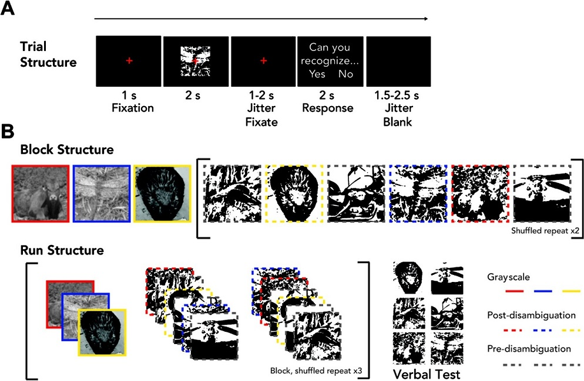

# README - Mooney MEG Project
By: 		MW Flounders and R Hardstone

Date:       20190228

Use: 		Flounders et al., 2019, Neural Dynamics of visual ambiguity resolution by perceptual prior
            [https://elifesciences.org/articles/41861]

  

______________________________________________________________________________
## Folder structure: see [wiki](https://github.com/mflounders/mooney-meg/wiki)
